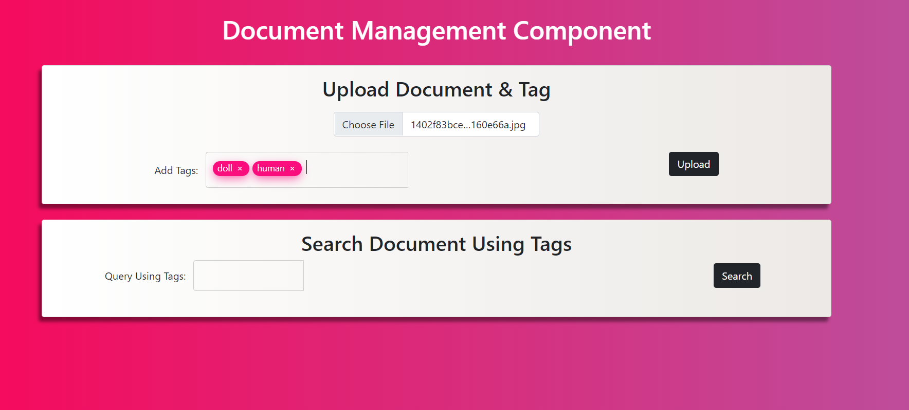
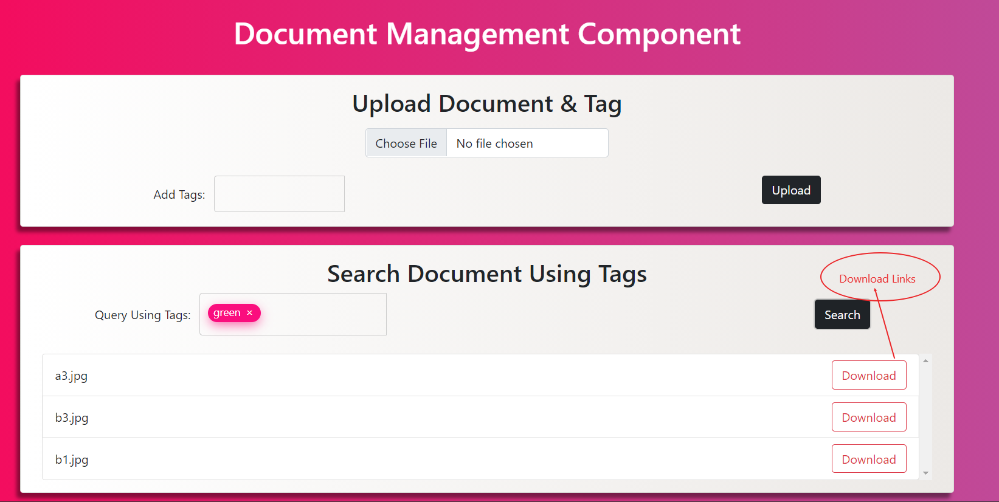

# Document MAnagement Component 

## How To Run The Application

1. Clone the repository
2. Install all the dependencies using NPM
```bash
$ npm install 
```
3. Turn on MongoDB in host machine(by default runs in Port: 27017). [Verify the step](https://zellwk.com/blog/local-mongodb/)
4. Start server in localhost(uses Port:3000) and cold start(upload sample data to database).
```bash
$npm run start
```
5. A new Database named `test-ramco` will be created in MongoDB. 
6. Open home page, [Test-Platform](http://localhost:3000/).(http://localhost:3000/)

### To Create Document with Tags

1. Upload document by clicking on choose file button.
2. Enter tags one by one.(**Click `enter` button after each tag to add multiple tags**)
3. Click Upload button
4. Notifed via alert message

<h1 align="center">

</h1>
<br>
### To Search for Documents based on Query

1. Enter tags one by one.(**Click `enter` button after each tag to add multiple tags**)
2. Click Search button
3. List of file metadata is returned based on on tag list.
4. User can download required file by clicking download button adjacent to respective file names.(To prevent downloading all files)

<h1 align="center">

</h1>
<br>
