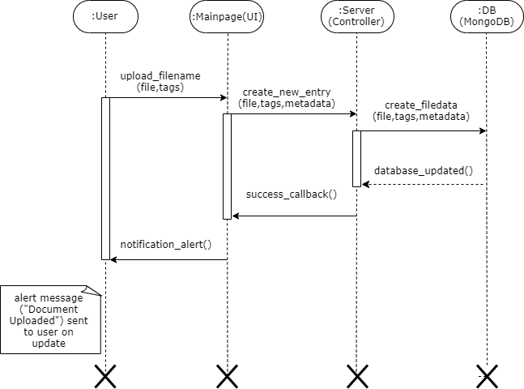
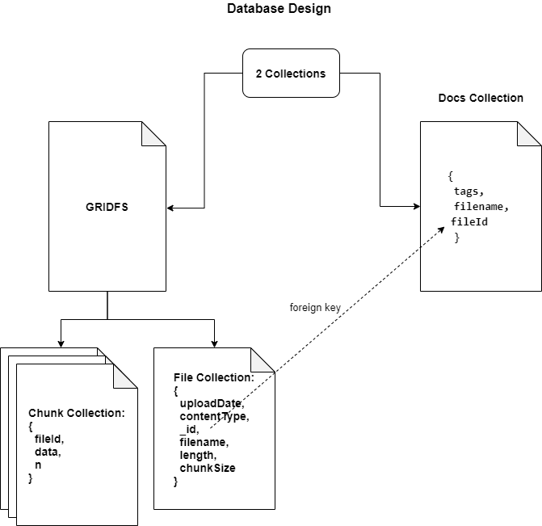

# Document MAnagement Component 

## How To Run The Application

1. Clone the repository
2. Install all the dependencies using NPM
```bash
$ npm install 
```
3. Turn on MongoDB in host machine(by default runs in Port: 27017). [Verify the step](https://zellwk.com/blog/local-mongodb/)
4. Start server in localhost(uses Port:3000) and cold start(upload sample data to database).
```bash
$npm run start
```
5. A new Database named `test-ramco` will be created in MongoDB. 
6. Open home page, [Test-Platform](http://localhost:3000/).(http://localhost:3000/)

### To Create Document with Tags

1. Upload document by clicking on choose file button.
2. Enter tags one by one.(**Click `enter` button after each tag to add multiple tags**)
3. Click Upload button
4. Notifed via alert message

<h1 align="center">

</h1>
<br>

### To Search for Documents based on Query

1. Enter tags one by one.(**Click `enter` button after each tag to add multiple tags**)
2. Click Search button
3. List of file metadata is returned based on on tag list.
4. User can download required file by clicking download button adjacent to respective file names.(To prevent downloading all files)

<h1 align="center">

</h1>
<br>

## Sequence Diagram

### To Tag and Upload Document:
<h1 align="center">

</h1>
<br>

### Retrieve Document based on Tags:
<h1 align="center">

</h1>
<br>

### No Document found for Tag list: (Alternate Scenario)
<h1 align="center">

</h1>
<br>


## Database Design (MondoDB Schema)

<h1 align="center">

</h1>
<br>

### The MongoDB contains two Collections:
 1. **docs** (Stores FileId and Tag mapping)
2  **Gridfs** (To store files)

#### Gridfd - stores file directly in MongoDB, used for storing files>16mb

GridFS stores files in two collections:
1. Chunks Collection stores the binary chunks. 
2. Files Collection stores the file’s metadata. 

Schema for Gridfs:
```javascript


// Files Collection - stores meta data
{
    length: (file length),
    chunkSize: (size of each chunk),
    filename: (name),
    _id: (dafult),
    contentType: (mime type),
    uploadDate: (date&time)
}

// Chunk Collection - stores data in binary format
{
    fileId : (maps to _id in files collection ),
    data: binary format,
    n: (numbered sequentially, since large files are split into smaller chunks and stored as a collection)
}

```


#### docs - a seperate collection of documents, contains mappinf of file id and tag list:

Schema for docs:
```javascript
{
    fileId : (maps to actual collection where file is stored in binary format),
    filename: (To show metadata preview),
    tags: (list of tags for querying)
}

```